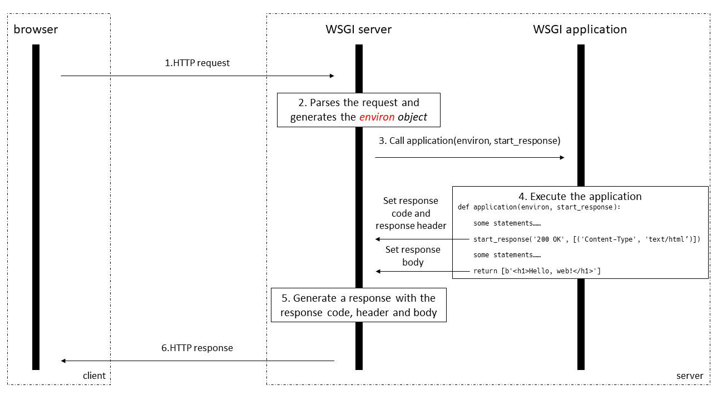

## Introduction

WSGI is an interface between a web server and a web framework/application. You can run any web framework/application on any web server as long as both of them comply with the WSGI interface, which introduces great flexibility when building a website with python.

### Example

A simple WSGI application is like the following:

```python
def application(environ, start_response):
    start_response('200 OK', [('Content-Type', 'text/html')])
    return [b'<h1>Hello, web!</h1>']
```

and the HTTP request processing flow is like the following:



Let's look into details of each step:

1\. The client sends the HTTP requests.

2\. The WSGI parses the HTTP request and use the parsing result to build the `environ` object. `environ` is a dictionary which contains variables defined in the CGI standard. For more details about this object, you can refer [PEP 3333](https://www.python.org/dev/peps/pep-3333/#environ-variables). 

3\. The WSGI call the WSGI application (a WSGI application must be a callable object) with two parameters, one is `environ` created in step 2, the other is a callable object `start_response`, whose usage is discussed below.

4\. The WSGI application starts to run, the main purpose of the WSGI application is to provide information to the WSGI server that are used to generate the HTTP response. The information can be divided into two parts, the response code and response headers are passed to the WSGI server by calling the `start_response` (only once), while the response body is passed through the `return` statement of the WSGI application. The response code, response headers and the response body can be generated dynamically with the `environ` object.

5\. The server generate an HTTP response with the status code, response headers and the response body it got in step 4.

6\. The response is sent back to the client side.

### WSGI Servers, Applications, Frameworks and Middleware

WSGI's website shows common WSGI [servers](https://wsgi.readthedocs.io/en/latest/servers.html), [applications](https://wsgi.readthedocs.io/en/latest/applications.html), [frameworks](https://wsgi.readthedocs.io/en/latest/frameworks.html), and [middleware and libraries](https://wsgi.readthedocs.io/en/latest/libraries.html), where the last three all belongs the **application side** of WSGI interface, differences among them are:

**WSGI Applications** refer to web application for specific usage that runs on a WSGI server, e.g., MoinMoin is a wiki engine. **WSGI Frameworks** are libraries for more general purpose which can be used to develop many different kinds of web application, e.g. Flask and Django. It may be very difficult to develop an application or a framework directly on the WSGI interface, one important reason is that the application have to deal with many HTTP headers for different mechanisms, e.g., you may have to respond to a request with the `If-Modified-Since` header with a `304 Not Modified` response, or you may want to respond to CORS requests with CORS response headers like `Access-Control-Allow-Origin`. A **WSGI Middleware** can encapsulate all these functions and provide a higher level interface for WSGI applications/frameworks developers to use with less effort.

A good example of an WSGI middleware and framework is Werkzeug and Flask. Werkzeug is an encapsulation of WSGI interface. Like the following example, users can create a `werkzeug.wrappers.Request` object with the `environ` object, which makes it easier to access HTTP header information. As for HTTP responses, the `werkzeug.wrappers.Response` can be used to set the response header and the response body. It's obvious that `start_response` should be passed to `Response.__call__`  as a parameter in order to build an HTTP response. But why `environ` should be a parameter too? It's because Werkzeug has implemented some basic HTTP header processing (e.g. CORS, ETag, which can be found [here](https://github.com/pallets/werkzeug/blob/master/src/werkzeug/wrappers/response.py)), which means these headers will be processed automatically without the effort of users. Besides, Werkzeug also implemented a simple WSGI server ("***This server is convenient to use, but is not designed to be particularly stable, secure, or efficient.***" which is commented in the [source code](https://github.com/pallets/werkzeug/blob/daeb2d0f6c911332ffbf17318553afc37b232d3a/src/werkzeug/serving.py)) which is used by Flask by default. 

```python
from werkzeug.wrappers import Request, Response

def application(environ, start_response):
    request = Request(environ)
    text = 'Hello %s!' % request.args.get('name', 'World')
    response = Response(text, mimetype='text/plain')
    return response(environ, start_response)
```

Flask is a web framework which can be used to build different web applications. Flask is implemented on top of Werkzeug, and it uses the Werkzeug WSGI server by default (by calling the `run_simple` function which can be found [here](https://github.com/pallets/flask/blob/master/src/flask/app.py)). However, each object of the `Flask` class is an application that conforms the WSGI interface, which means it's a callable object with two parameters (by implementing the `_call__` method).